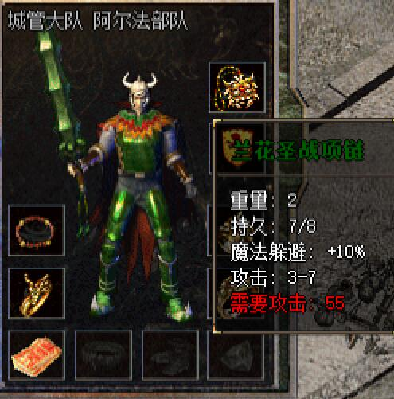
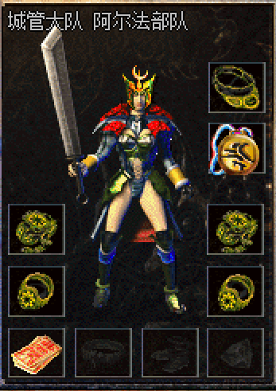
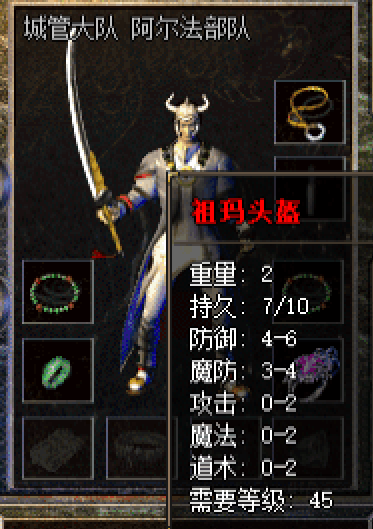

-------
[首页](../index.html)
[上一页](javascript:history.back(-1))

-------
# 战士装备
####首饰

* **圣战套装**

> 套装属性：

| 名称 | 属性 | 
| --- | --- | 
| 圣战头盔 | 防御4-5 魔御2-3 攻击0-1 需要攻击力45 |
| 圣战项链 | 攻击3-6 需要攻击力45 |
| 圣战手镯 | 防御0-1 攻击2-3 需要攻击力45 | 
| 圣战戒指 | 魔御0-1 攻击0-7 需要攻击力45 |

-------

* **兰花圣战套装**

> 套装属性：

| 名称 | 属性 |  |
| --- | --- | --- |
| 兰花圣战项链 | 重量2  持久8  攻击3-7  魔法躲避+10%  需要攻击55  | |
| 兰花圣战手镯 | 重量2  持久8  防御0-1  攻击2-4  需要攻击55 |  |
| 兰花圣战戒指 | 重量2  持久8  防御0-1  攻击0-8  需要攻击55 |  |

-------

* **白虎套装**

> 套装属性：

| 名称 | 属性 |  |
| --- | --- | --- |
| 白虎项链 |  |  |
| 白虎手镯 |  |  |
| 白虎戒指 |  |  |

-------

####武器
| 名称 | 属性 |  |
| --- | --- | --- |
|屠龙   | 重量99  持久33  攻击5-35  需要等级34 |   |
|暗黑裁决| 重量62  持久45  攻击15-30  准确+2  需要攻击55 |   |
|霸王斩  | 重量50  持久33  攻击20-30  准确+3  需要攻击60 |   |
|骑士之刃| |   |
|索命   |  |   |
|乾坤   |  |   |
|虎啸   |  |   |

####头盔
| 名称 | 属性 | |
| --- | --- | --- |
|祖玛头盔|重量2  持久10  防御4-6  魔防3-4  攻击0-2  魔法0-2  道术0-2  需要等级45 |   |
|恶魔头盔| |   | 

####衣服
| 名称 | 属性 |   |
| --- | --- | ---|
|战神盔甲| |   |
|钢盔甲  | 重量45  持久34  防御6-9  魔防4-5  攻击1-5  需要等级42 |   |
|白虎战甲| |   |
|男战天魔| |   |
|女战天魔| |   |

-------
[首页](../index.html)
[上一页](javascript:history.back(-1))

-------

