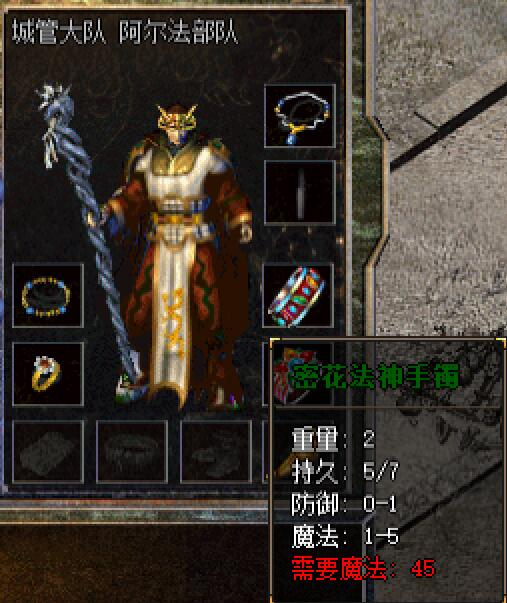
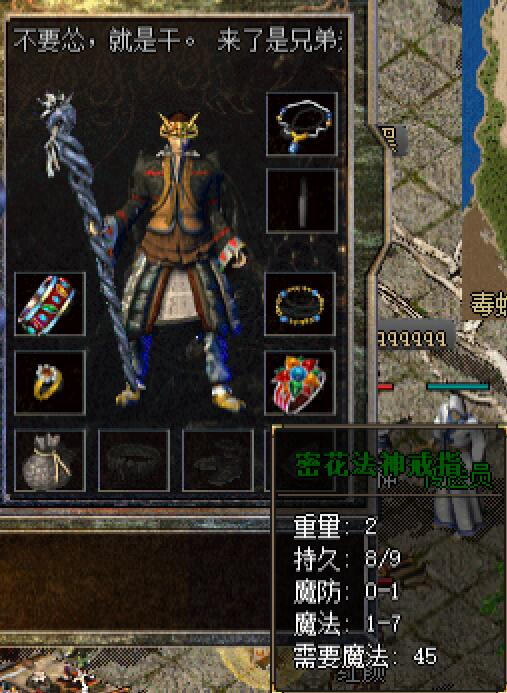
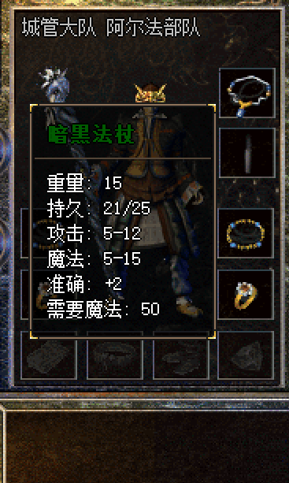
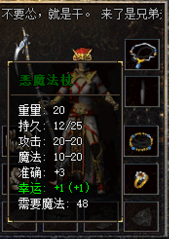
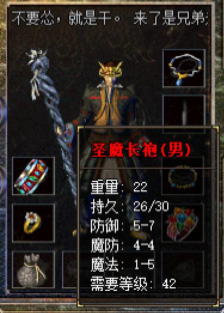
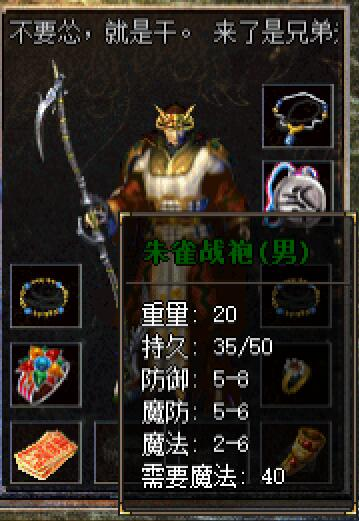

# 法师装备
####首饰

* **法神套装**

> 套装属性：

| 名称 | 属性 |
| --- | --- |
| 法神头盔 | 防御4-4 魔防1-2 魔法0-1 | 
| 法神项链 | 魔法0-8 准确+ 2 |
| 法神手镯 | 防御0-1 魔法0-4 | 
| 法神戒指 | 魔防0-1 魔法1-6 | 

-------

* **密花法神套装**

> 套装属性：

| 名称 | 属性 |  |
| --- | --- | --- |
| 密花法神项链 |   |  |
| 密花法神手镯 |   |  |
| 密花法神戒指 |   |  |

-------

* **朱雀套装**

> 套装属性：

| 名称 | 属性 |  |
| --- | --- | --- |
| 朱雀项链 |  |  |  |
| 朱雀手镯 |  |  |  |
| 朱雀戒指 |  |  |  |

-------

####武器
| 名称 | 属性 |  |
| --- | --- | --- |
|嗜魂法杖 |  |   |
|暗黑法杖 |  |   |
|恶魔法杖 |  |   |
|玄冥    |  |   |
|金轮    | |   |
|龙爪    | |   |
|紫金杖  |  |   |

####头盔
| 名称 | 属性 | |
| --- | --- | --- |
|祖玛头盔| |   |
|勇士头盔|  |   | 

####衣服
| 名称 | 属性 |  |
| --- | --- | --- |
|恶魔长袍|  |   |
|圣魔长袍| |   |
|朱雀战袍|  |   |
|男法天魔| |   |
|女法天魔|   |   |

