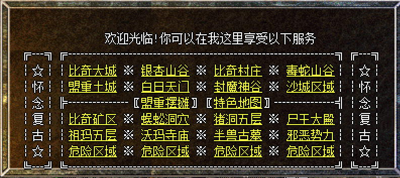
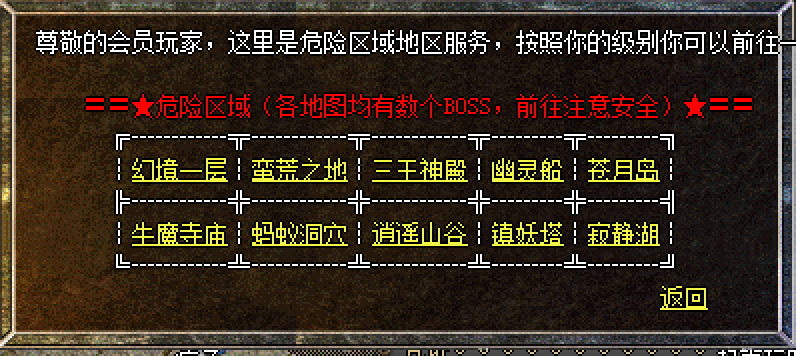

# 地图

### 普通危险区域
| 地图名称 | 地图名称 | 地图名称 | 地图名称 | 
| --- | --- | --- | --- | 
|比奇矿区 | 蜈蚣洞穴| 猪洞五层 | 尸王殿|
|祖玛寺庙 | 沃玛寺庙| 半兽古墓 | 邪恶势力|

* 蜈蚣洞是前期升级圣地，运气好遇到**邪恶钳虫**也许会有惊喜。
* 猪洞石墓阵中会刷一个**野猪教皇**，白野猪梦宠契约，猪八、猪九通行证的爆率较高。从猪洞七层可进入猪洞八层（BOSS：**野猪教皇、教后**）和桃源之门（BOSS:**野猪教皇**、**骷髅王**），从猪洞八层可进入猪洞九层（BOSS：**蝎蛇教皇、教后**），进入猪八猪九均需要凭证。
* 尸王殿主要是爆书页的地方，书页可以用来强化技能，非常保值。
* 祖玛寺庙主要是前期升级和获取祖玛级别装备
* 沃玛寺庙内有**沃玛教皇、教后**
* 半兽古墓内内有**骷髅王**

-------

### 高级危险区域
| 地图名称 | 地图名称 | 地图名称 | 地图名称 | 地图名称 |
| --- | --- | --- | --- | --- |
|[幻境](幻境.html) | [蛮荒之地](蛮荒之地.html) | [三王神殿](三王神殿.html) | [幽灵船](幽灵船.html) | [苍月岛](苍月岛.html) |
| [牛魔寺庙](牛魔寺庙.html)| [蚂蚁洞穴](蚂蚁洞穴.html) | [逍遥山谷](逍遥山谷.html) | [镇妖塔](镇妖塔.html) | [寂静湖](寂静湖.html) |

-------

### 特色地图

####梦宠圣殿
* 进入方式：土城书店旁监狱NPC
* 进入条件：法师+梦宠契约
* 地图特色：每逢三的倍数整点时（比如3：00、6：00、9：00）会刷新六个异常凶猛的梦宠，分别是白野猪、祖玛卫士、祖玛雕像、月魔蜘蛛（带麻痹）、沃玛教主（带电）、邪恶毒蛇（带电），**法师等级达到46级才可召唤**。

> 1、记忆套装可以将其他人传送进入
> 2、召唤时梦宠可能会直接死亡
> 3、梦宠叛变时间>6小时
> 4、人物死亡梦宠也会自动死亡
> 5、人物摆摊后大退梦宠不会消失，可以借此交换梦宠

####行会争霸地图
* 进入方式：土城行会争霸NPC
* 进入条件：人物达到43级且已加入行会，每天20：10-21：00之间可进入
* 地图特色：每秒获得1500经验，最后一个人可领取500W金币（需在21：00-21：20分之间领取）

-------

### 其他地图介绍
* 重装地图

| 地图名称 | 怪物名称 | 进入方式 |
| --- | --- | --- | 
|困惑殿堂| 暗之双头血魔 | 石墓7层->桃源之门 （55，94）|
|地狱烈焰| 暗之骷髅精灵 | 比奇大城（428，474） |
|堕落坟场| 暗之黄泉教主 | 沃玛森林（320，56）|
|死亡神殿| 暗之虹魔教主 | 封魔谷（205，218）|
|深渊魔域| 暗之双头金刚 | 沃玛森林（215，312）|
|钳虫巢穴| 暗之沃玛教主 | 白日门（362，326）|

> 所有重装怪必爆一点声望，有几率掉落白虎战甲、青龙战衣、朱雀战袍、赤月、祖玛装备。

-------

* 封魔矿区

> 1、前期可在疾风殿、霸者大厅等地图打白野猪升级和获取祖玛装备，有几率掉落萌宠契约和猪八猪九通行证
> 2、矿区连接接通道刷尸王，有几率爆**书页**
> 3、魔魂殿有**蝎蛇教皇**，封魔殿有**虹魔教主**、**骷髅王**、**蝎蛇教皇**等boss，有几率掉落白虎战甲、青龙战衣、朱雀战袍、声望卷、赤月、祖玛装备。

-------

* 未知暗殿

