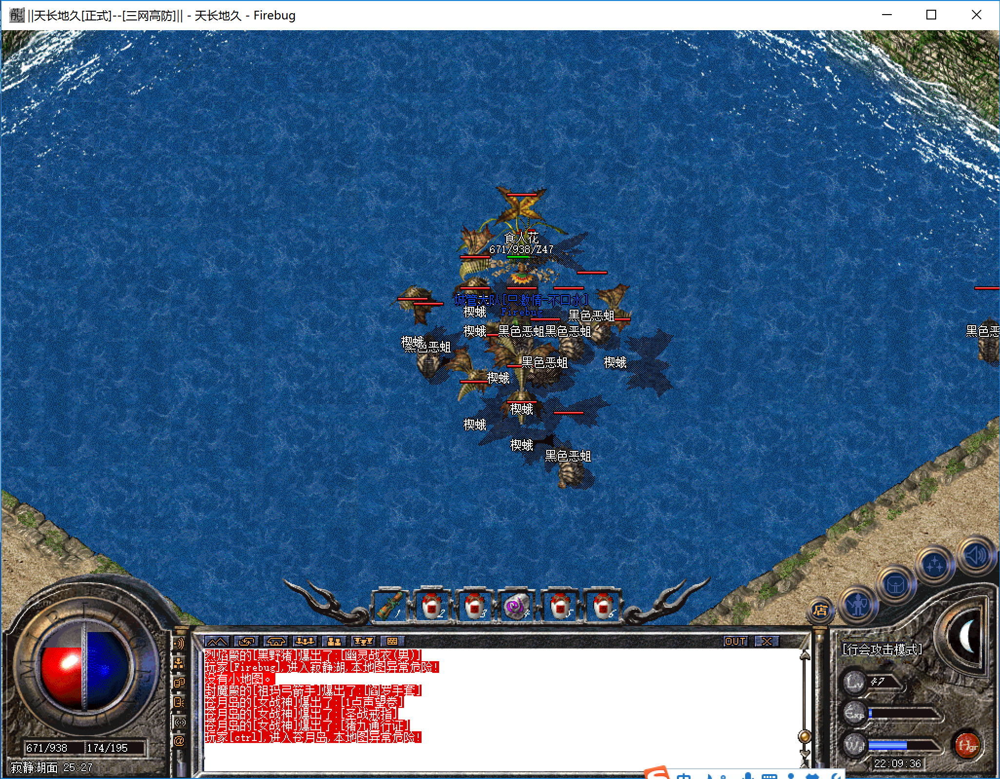
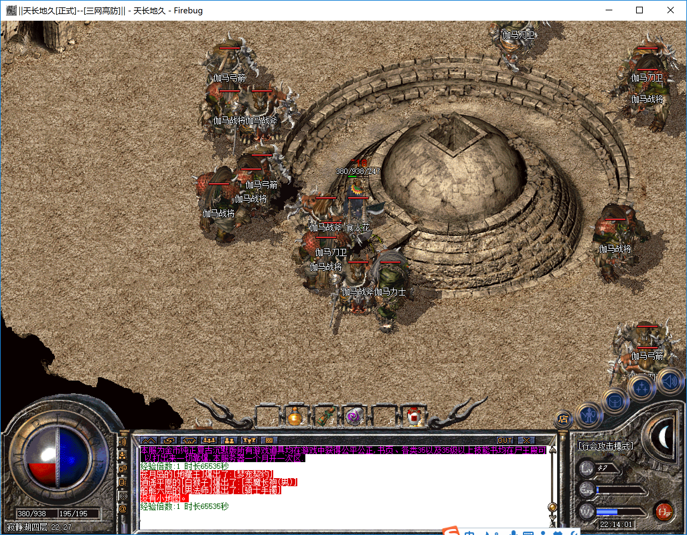
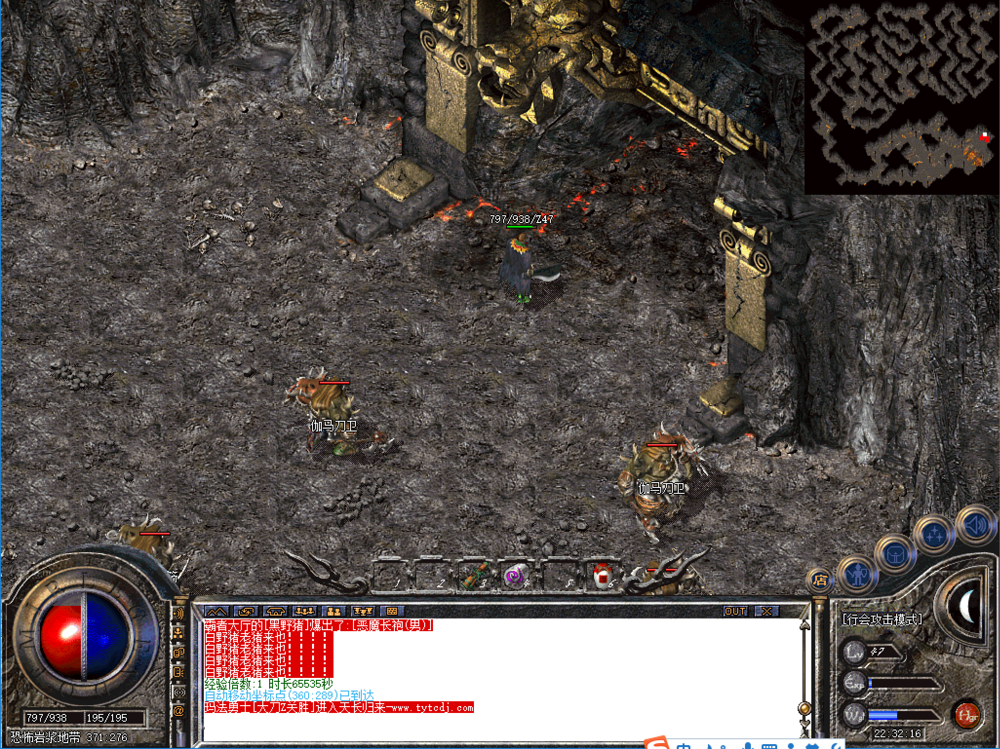
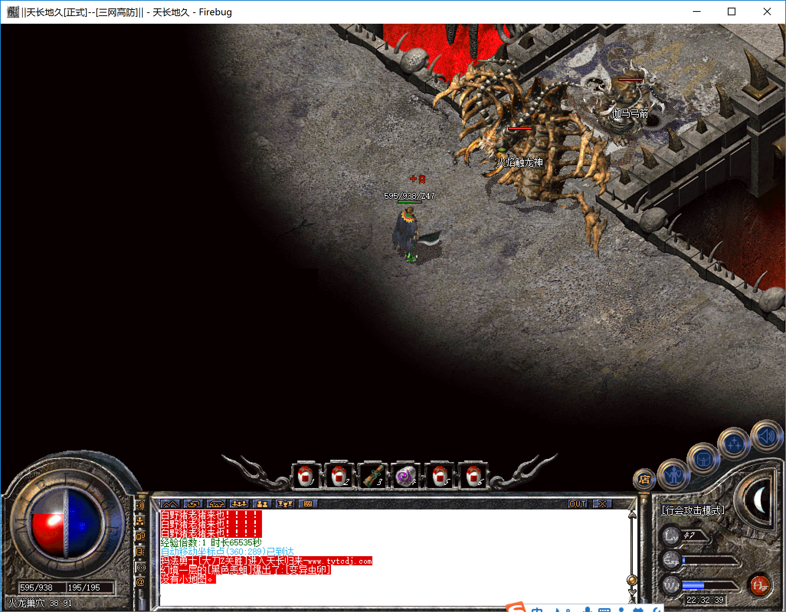

-------
[首页](../index.html)
[上一页](javascript:history.back(-1))

-------
# 寂静湖

* 进入方式：安全区传送员→危险区域→寂静湖
* 进入条件：等级40，金币5W
* 地图路线：寂静湖面→寂静湖一层→寂静湖二层→寂静湖三层→寂静湖四层→恐怖岩浆地带→火龙巢穴→噩梦之园（简称湖底）

```
 tips：所有地图不允许使用随机
```

####寂静湖面
* 危险系数：★☆☆☆☆
* 装备爆率：★☆☆☆☆
* 刷新时间：半小时
* 怪物：黑色恶蛆、楔蛾、食人花
* Boss：无


```
tips：进入下层坐标为25,25,即食人花所在的位置，进入下层不需要杀死食人花.
```

####寂静湖一层
* 危险系数：★★☆☆☆
* 装备爆率：★★☆☆☆
* 刷新时间：1小时
* 怪物：双头金刚&双头血魔（攻击非常高）、飞蛾（爆疗伤药有麻痹属性）
* Boss：嗜血魔王、骷髅王各一个


```
tips：进入下层之前可以多打飞蛾储备疗伤药。下层入口处怪物较集中，非常危险，不好进入的话需要多引几次。
```

####寂静湖二层
* 危险系数：★★★☆☆
* 装备爆率：★★★☆☆
* 刷新时间：1小时
* 怪物：飞蛾
* Boss：伽马之王（近战）一个


```
tips：二层伽马王为近战攻击，道士可以用麒麟单挑，法师可以用梦宠单挑。
```

####寂静湖三层
* 危险系数：★★★☆☆
* 装备爆率：★★★☆☆
* 刷新时间：1小时
* 怪物：飞蛾
* Boss：伽马之王（远程）一个


```
tips：三层伽马王为远程攻击，道士可以用麒麟单挑，法师可以用梦宠单挑。
```

####寂静湖四层
* 危险系数：★★☆☆☆
* 装备爆率：★★☆☆☆
* 刷新时间：未知
* Boss：无


####恐怖岩浆地带
* 危险系数：★☆☆☆☆
* 装备爆率：★☆☆☆☆
* 刷新时间：未知
* Boss：无



####火龙巢穴
* 危险系数：★★★★☆
* 装备爆率：★★★★☆
* 刷新时间：1小时
* Boss：火焰触龙神、伽马之王（近战）、伽马之王（远程）各一个



####噩梦之园
* 危险系数：★★★★★
* 装备爆率：★★★★★
* 刷新时间：1小时
* Boss：男女战神（近战）、男女法神（远程）、男女道神（远程）、伽马之王（近战）、伽马之王（远程）、金石狮（近战）、金石狮（远程）、蚁后（近战）、蚁后（远程）、地狱恶魔（全屏）、蝎蛇教皇（近战）、野猪教皇（近战）、沃玛教后（近战）、牛魔王各一个


-------

**寂静湖是一个爆率和危险系数成正比的地方，前面的伽马之王道士或者带梦宠的法师都可以单独击杀，火焰触龙神也有无伤击杀卡位点，但是湖底必须多个职业配合才能击杀完BOSS，稍不注意可能全军覆没。**

**湖底地图是一个很小的正方形地图，地图下点在正方形的中间，里面充斥着各类近战、远程、AOE攻击的怪物，尤其注意神和带电BOSS。如果不了解地图下的怪物分布情况最好是一个战士下去将怪物引到一个方向后回城，然后其他队友再下来找安全的位置集合后将BOSS各个击破，地图中间位置有一个卡位点，没有明显的标志，需要大家自己去摸索，。**

**职业搭配最好三职业各至少一个，道士负责引怪，上毒，法师远程卡位杀除神以外的其他BOSS，如果有萌宠不带电的boss可以不用卡位，战士杀神，至于怪物的击杀顺序需要根据当时地图内的怪物分布情况来定，最好是不要先击杀法神、道神、射箭伽马王，因为这几个怪在攻击和受攻击过程中会频繁的移动，还有就是尽可能的先击杀不带电的近战攻击怪物再击杀带电或者远程攻击的怪物。**

**当然，爆率超高，boss超多的地图也是兵家必争之地，怎么抢下本地图就看大家的技术了。祝大家好运，爆乾坤虎啸龙爪！！**

-------
[首页](../index.html)
[上一页](javascript:history.back(-1))

-------


