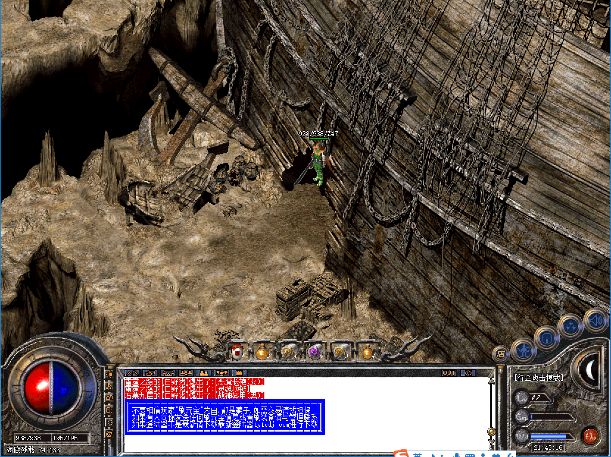
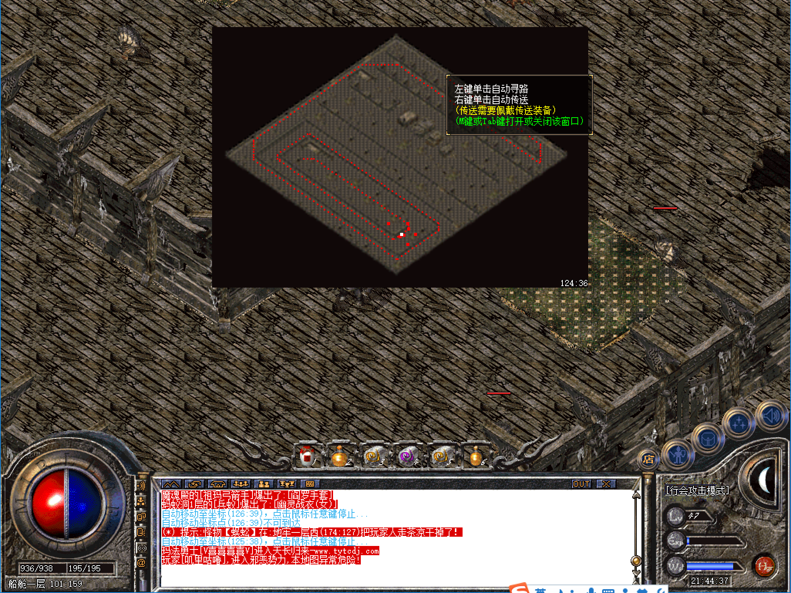
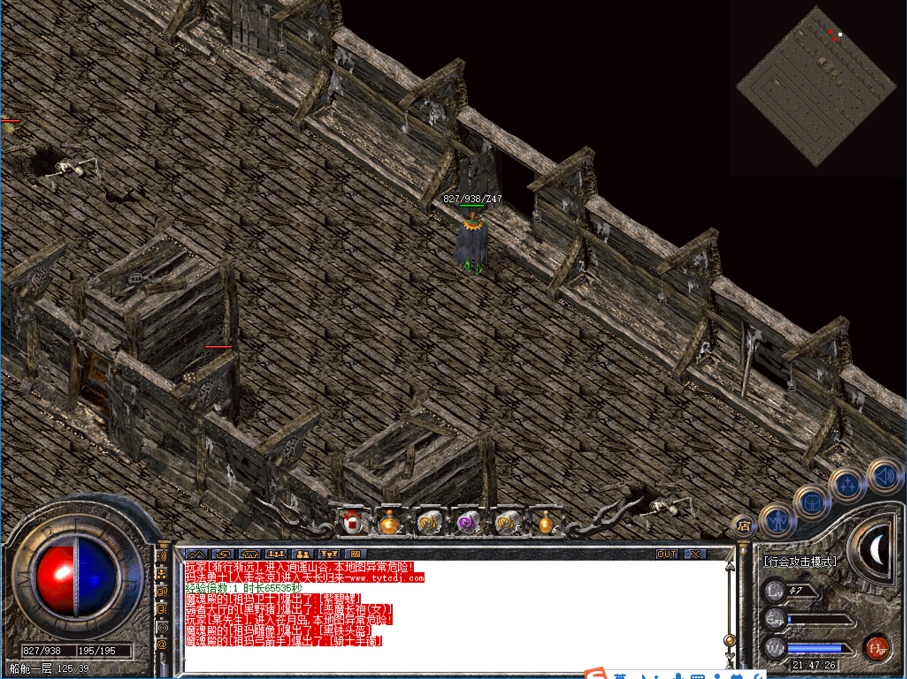
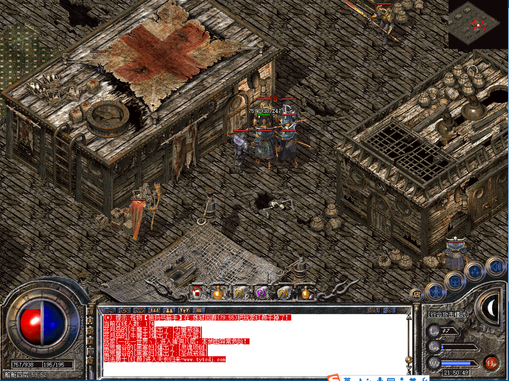
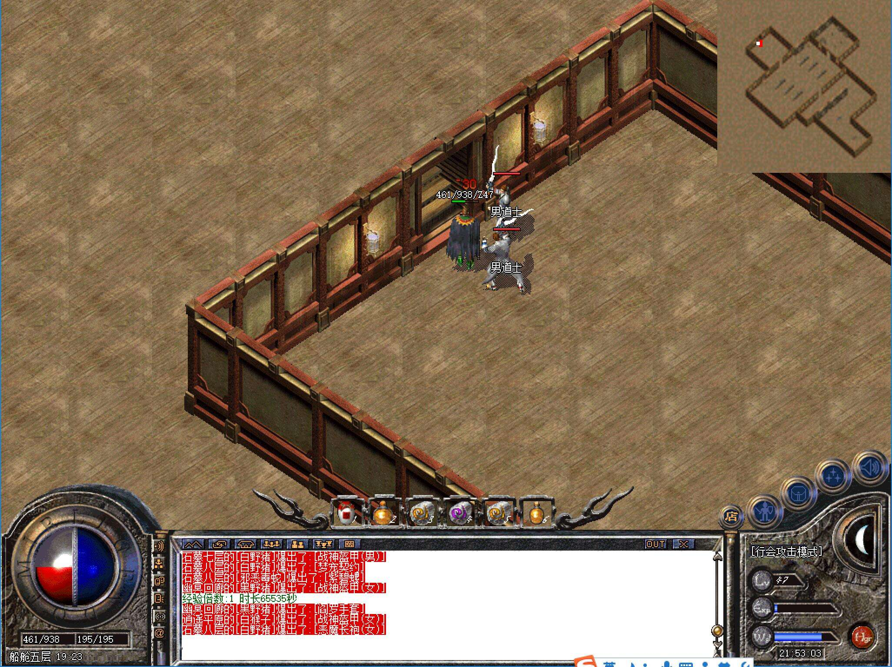
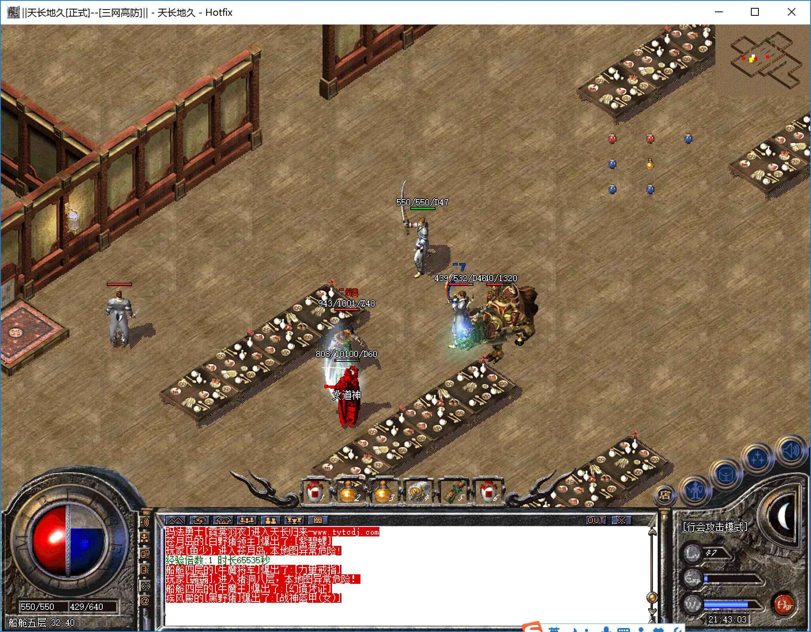
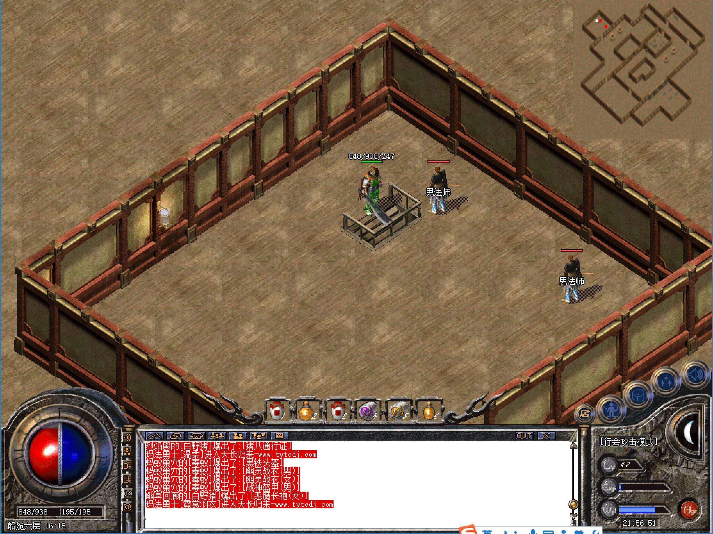
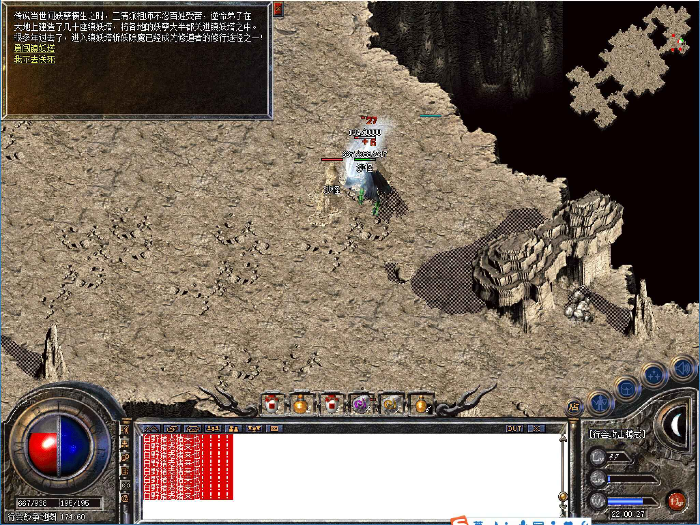
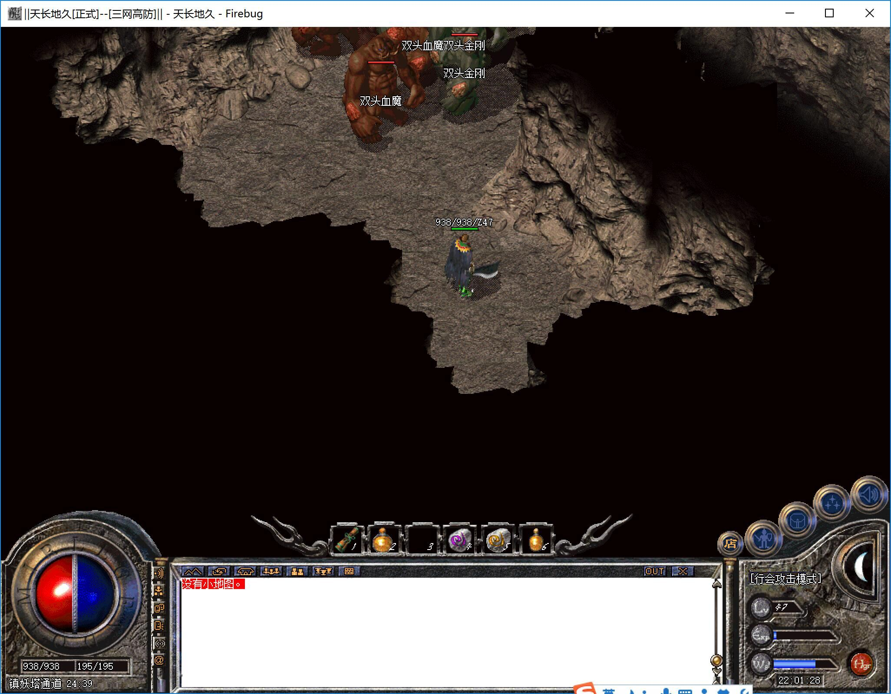

# 幽灵船

* 进入方式：安全区传送员→危险区域→幽灵船
* 进入条件：等级40，金币5W
* 地图路线：海底残骸→船舱一层→船舱二层→船舱三层→船舱四层→船舱五层→船舱六层→船舱七层→船舱顶层→镇妖塔通道→[镇妖塔](镇妖塔.html)

```
 tips：允许使用随机
```

-------


####海底残骸
* 危险系数：☆☆☆☆☆
* 装备爆率：☆☆☆☆☆
* 怪物：无
* Boss：无


-------


####船舱一层
* 危险系数：★★☆☆☆
* 装备爆率：★★☆☆☆
* 刷新时间：1小时
* 怪物：黑色恶蛆、楔蛾、白野猪等
* Boss：野猪教皇

-------


####船舱二层
* 危险系数：★★☆☆☆
* 装备爆率：★★☆☆☆
* 刷新时间：1小时
* 怪物：黑色恶蛆、楔蛾、白野猪等
* Boss：蝎蛇教皇

-------


####船舱三层
* 危险系数：★★☆☆☆
* 装备爆率：★★☆☆☆
* 刷新时间：1小时
* 怪物：黑色恶蛆、楔蛾、白野猪等
* Boss：地狱恶魔



```
tips：前面三层地图一样
```

-------


####船舱四层
* 危险系数：★★☆☆☆
* 装备爆率：★★☆☆☆
* 刷新时间：1小时
* Boss：牛魔王两个


```
tips：进入下层的入口在有红十字架的房子那个门
```

-------


####船舱五层
* 危险系数：★★★★☆
* 装备爆率：★★★★☆
* 刷新时间：1小时
* Boss：男道神、女道神



-------


####船舱六层
* 危险系数：★★★★☆
* 装备爆率：★★★★☆
* 刷新时间：1小时
* Boss：男法神、女法神


-------


####船舱七层
* 危险系数：★★★★☆
* 装备爆率：★★★★☆
* 刷新时间：1小时
* Boss：男战神、女战神


-------

####船舱顶层
* 危险系数：★★★★☆
* 装备爆率：☆☆☆☆☆
* 刷新时间：1小时
* 怪物：沙怪
* Boss：金石狮、玉石狮


```
tips：进入镇妖塔通道可点击NPC进入也可以走石门中间进入。
```

-------

####镇妖塔通道
* 危险系数：★★★★☆
* 装备爆率：☆☆☆☆☆
* 刷新时间：1小时
* 怪物：双头金刚、双头血魔
* Boss：无


-------
####[镇妖塔](镇妖塔.html)
* 危险系数：★★★★★
* 装备爆率：★★★★★
* 刷新时间：1小时
* Boss：伽马之王、火焰触龙神


