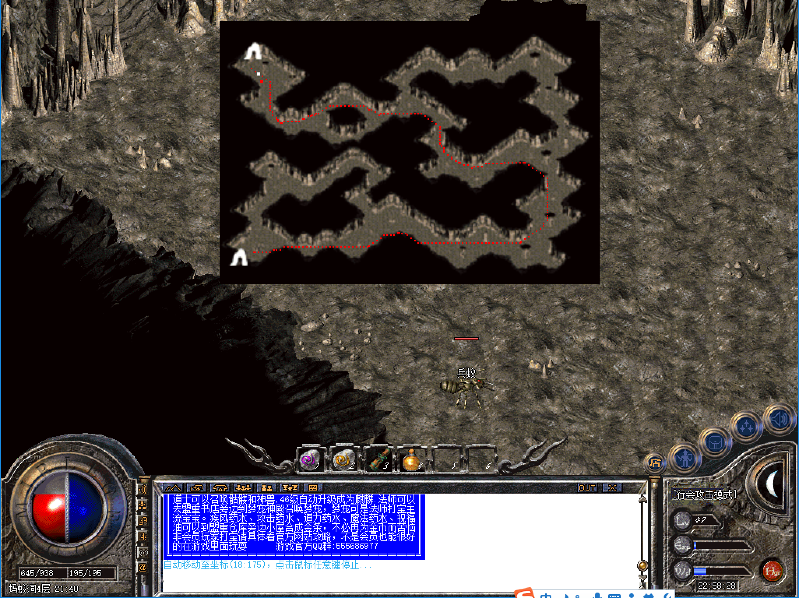

-------
[首页](../index.html)
[上一页](javascript:history.back(-1))

-------
# 蚂蚁洞穴

* 进入方式：安全区传送员→危险区域→蚂蚁洞穴
* 进入条件：等级40，金币5W
* 地图路线：蚂蚁洞一层→蚂蚁洞二层→蚂蚁洞三层→蚂蚁洞四层→蚂蚁巢穴

```
 tips：允许使用随机
```

####蚂蚁洞一层
* 危险系数：★☆☆☆☆
* 装备爆率：★☆☆☆☆
* 怪物：工蚁、兵蚁
* Boss：无


####蚂蚁洞二层
* 危险系数：★☆☆☆☆
* 装备爆率：★☆☆☆☆
* 怪物：工蚁、兵蚁
* Boss：无


####蚂蚁洞三层
* 危险系数：★☆☆☆☆
* 装备爆率：★☆☆☆☆
* 怪物：工蚁、兵蚁
* Boss：无


####蚂蚁洞四层
* 危险系数：★★★☆☆
* 装备爆率：★★★☆☆
* 刷新时间：1小时
* 怪物：工蚁、兵蚁、邪恶蚂蚁
* Boss:蚁后（近战）一个


####蚂蚁巢穴
* 危险系数：★★★★☆
* 装备爆率：★★★★☆
* 刷新时间：1小时
* Boss：蚁后（近战）、蚁后（电）各一个


```
tips：可在如图位置卡位杀，有几率爆各种顶级装备
```

-------
[首页](../index.html)
[上一页](javascript:history.back(-1))

-------


