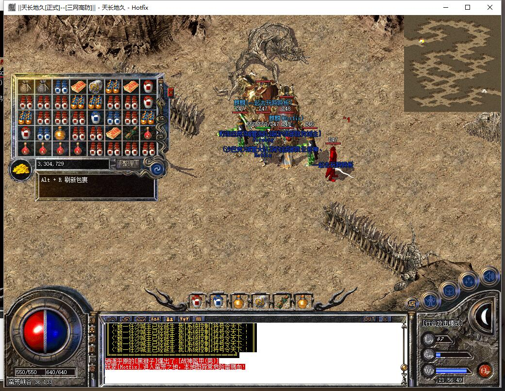
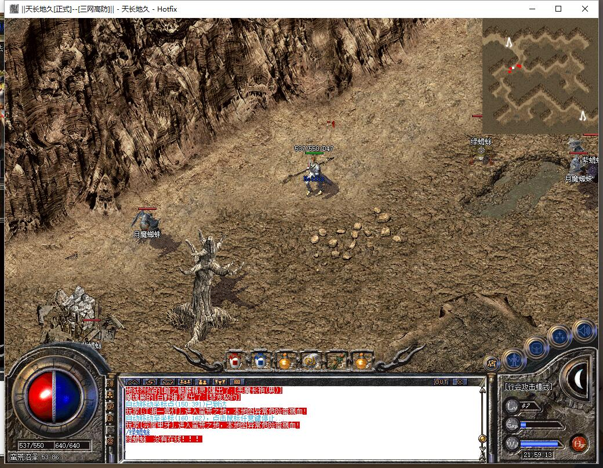
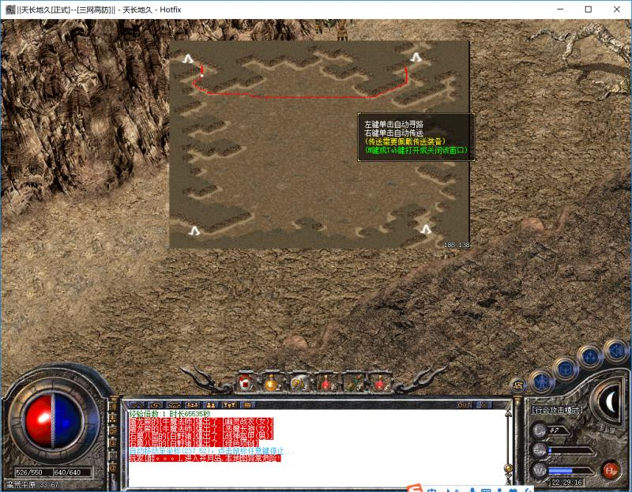
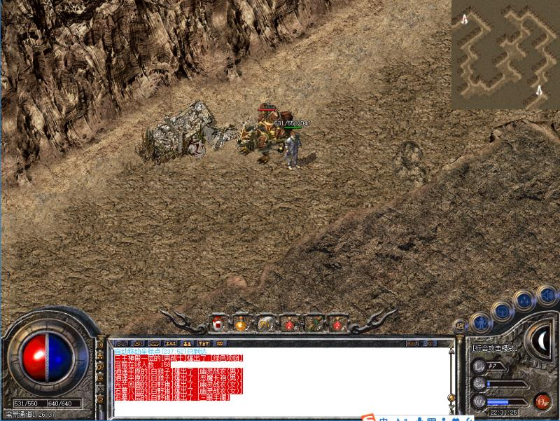
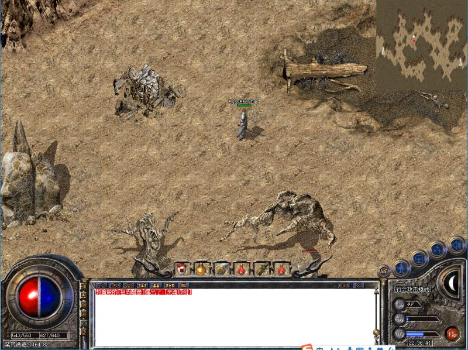
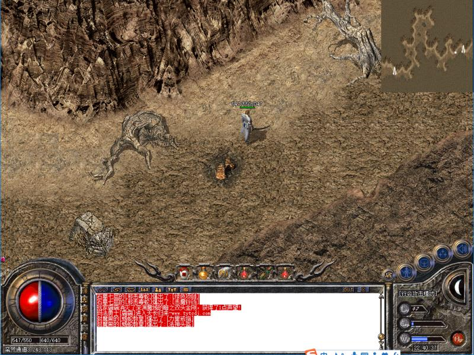
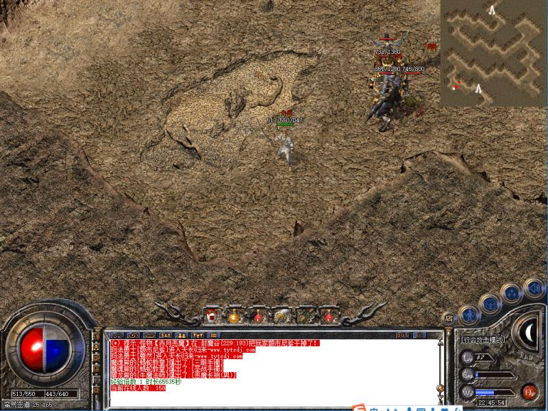
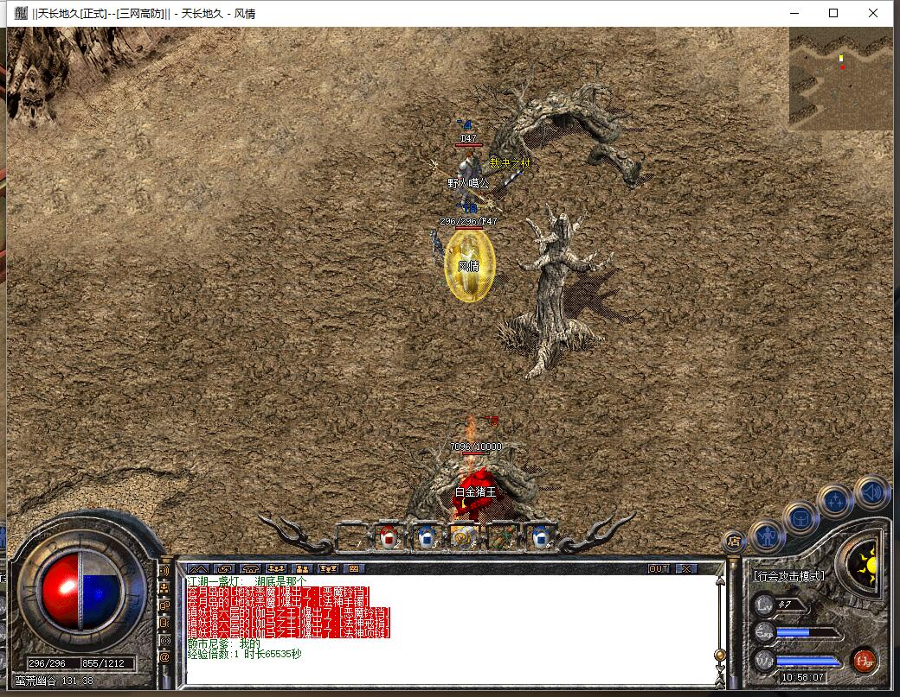
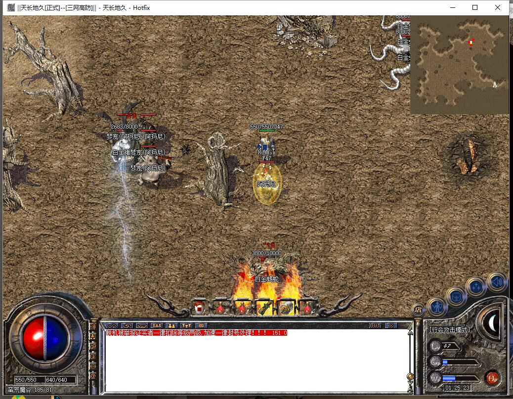

-------
[首页](../index.html)
[上一页](javascript:history.back(-1))

-------
# 蛮荒之地

* 进入方式：安全区传送员→危险区域→蛮荒之地
* 进入条件：等级40，金币5W
* 地图路线：蛮荒峡谷→蛮荒沼泽→蛮荒平原→蛮荒通道1→蛮荒通道2→蛮荒通道3→蛮荒密道→蛮荒幽谷→蛮荒魔谷

```
 tips：蛮荒沼泽之后地图均不允许使用随机
```
####蛮荒峡谷
* 危险系数：★☆☆☆☆
* 装备爆率：☆☆☆☆☆


####蛮荒沼泽
* 危险系数：★☆☆☆☆
* 装备爆率：☆☆☆☆☆
* 刷新时间：1小时
* Boss：金蜥蜴


####蛮荒平原
* 危险系数：★☆☆☆☆
* 装备爆率：☆☆☆☆☆
* Boss：无


####蛮荒通道1
* 危险系数：★★☆☆☆
* 装备爆率：★☆☆☆☆
* 刷新时间：1小时
* 怪物：玉虎
* Boss：玉虎（HP10000）


####蛮荒通道2
* 危险系数：★★☆☆☆
* 装备爆率：★☆☆☆☆
* 刷新时间：1小时
* 怪物：玉石狮
* Boss：玉石狮（HP10000）


####蛮荒通道3
* 危险系数：★★☆☆☆
* 装备爆率：★☆☆☆☆
* 刷新时间：1小时
* 怪物：牛魔雕像
* Boss：牛魔雕像（HP10000）


####蛮荒密道
* 危险系数：★★★☆☆
* 装备爆率：★★☆☆☆
* 刷新时间：1小时
* 怪物：玉虎、玉石狮、牛魔雕像、月魔蜘蛛等
* Boss：黑寡妇


####蛮荒幽谷
* 危险系数：★★★★★
* 装备爆率：★★★★★
* 刷新时间：1小时
* Boss：玉石狮、牛魔雕像、玉虎、白金猪王（电）、白金蝎蛇（电）、黑寡妇、金甲王


```
tips：玉石狮、牛魔雕像、玉虎有真的和假的，真的是10000HP的，白金猪王、白金蝎蛇本地图没有假的。
```

####蛮荒魔谷
* 危险系数：★★★★★
* 装备爆率：★★★★★
* 刷新时间：1小时
* Boss：白蜥蜴、红蜥蜴、白金猪王（电）、白金蝎蛇（电）、黑寡妇、黑寡妇（电）、金甲王、金甲王（射箭）


```
tips：白蜥蜴、红蜥蜴、白金猪王（电）、白金蝎蛇（电）有真的和假的，真的是10000HP的。
```

-------


**一个区别真假怪物的小技巧就是将鼠标放到怪物身上，真BOSS显示的LV跟假的会有区别，比如假的白金猪王是LV52,真的是LV60.
以上几个带电的怪物异常凶猛，法师掉盾可能瞬间被秒，所以需要卡位打，卡位点如上图所示，将怪物引入树桩中间，然后跟怪物站一条直线，注意不要站的离怪物太近，否则放电的会电死你，幽谷和魔谷内均有多处，需各位进游戏摸索。
此地图打BOSS最好的职业搭配是一道+一法（带梦宠更好），当然法师越多效率越高。这个地图爆率非常高，打怪难度相对噩梦之园较低，所以也是各大小团队和散人的必争之地，所以进去做好打架的准备。**

-------
[首页](../index.html)
[上一页](javascript:history.back(-1))

-------


