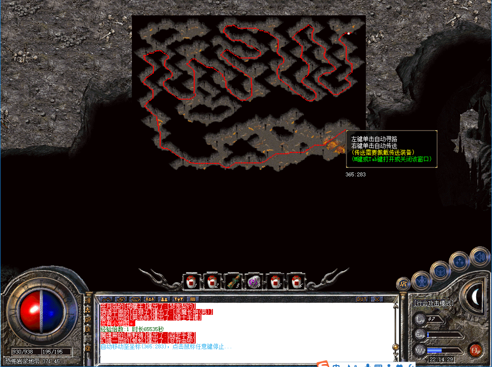

# 寂静湖

* 进入方式：安全区传送员→危险区域→寂静湖
* 进入条件：等级45，金币2W
* 地图路线：寂静湖面→寂静湖一层→寂静湖二层→寂静湖三层→寂静湖四层→恐怖岩浆地带→火龙巢穴→噩梦之园

```
 tips：所有地图不允许使用随机
```

####寂静湖面
* 危险系数：★☆☆☆☆
* 装备爆率：★☆☆☆☆
* 刷新时间：半小时
* 怪物：黑色恶蛆、楔蛾、食人花
* Boss：无


```
tips：进入下层坐标为25,25,即食人花所在的位置，进入下层不需要杀死食人花.
```

####寂静湖一层
* 危险系数：★★☆☆☆
* 装备爆率：★★☆☆☆
* 刷新时间：1小时
* 怪物：双头金刚&双头血魔（攻击非常高）、飞蛾（爆疗伤药有麻痹属性）
* Boss：嗜血魔王、骷髅王各一个


```
tips：进入下层之前可以多打飞蛾储备疗伤药。下层入口处怪物较集中，非常危险，不好进入的话需要多引几次。
```

####寂静湖二层
* 危险系数：★★★☆☆
* 装备爆率：★★★☆☆
* 刷新时间：1小时
* 怪物：飞蛾
* Boss：伽马之王（近战）一个


```
tips：二层伽马王为近战攻击，道士可以用麒麟单挑，法师可以用梦宠单挑。
```

####寂静湖三层
* 危险系数：★★★☆☆
* 装备爆率：★★★☆☆
* 刷新时间：1小时
* 怪物：飞蛾
* Boss：伽马之王（远程）一个


```
tips：三层伽马王为远程攻击，道士可以用麒麟单挑，法师可以用梦宠单挑。
```

####寂静湖四层
* 危险系数：★☆☆☆☆
* 装备爆率：★☆☆☆☆
* 刷新时间：未知
* Boss：无


####恐怖岩浆地带
* 危险系数：★☆☆☆☆
* 装备爆率：★☆☆☆☆
* 刷新时间：未知
* Boss：无



####火龙巢穴
* 危险系数：★★★★☆
* 装备爆率：★★★★☆
* 刷新时间：1小时
* Boss：火焰触龙神、伽马之王（近战）、伽马之王（远程）各一个


####噩梦之园
* 危险系数：★★★★★
* 装备爆率：★★★★★
* 刷新时间：1小时
* Boss：男女战神（近战）、男女法神（远程）、男女道神（远程）、伽马之王（近战）、伽马之王（远程）、金石狮（近战）、金石狮（远程）、蚁后（近战）、蚁后（远程）、地狱恶魔（全屏）、蝎蛇教皇（近战）、野猪教皇（近战）、沃玛教后（近战）、牛魔王各一个


```
tips：本地图基本上刷全服所有顶级boss，爆所有顶级装备，当然也异常凶险，需要多职业配合才能击杀怪物。
```

## Getting Started


