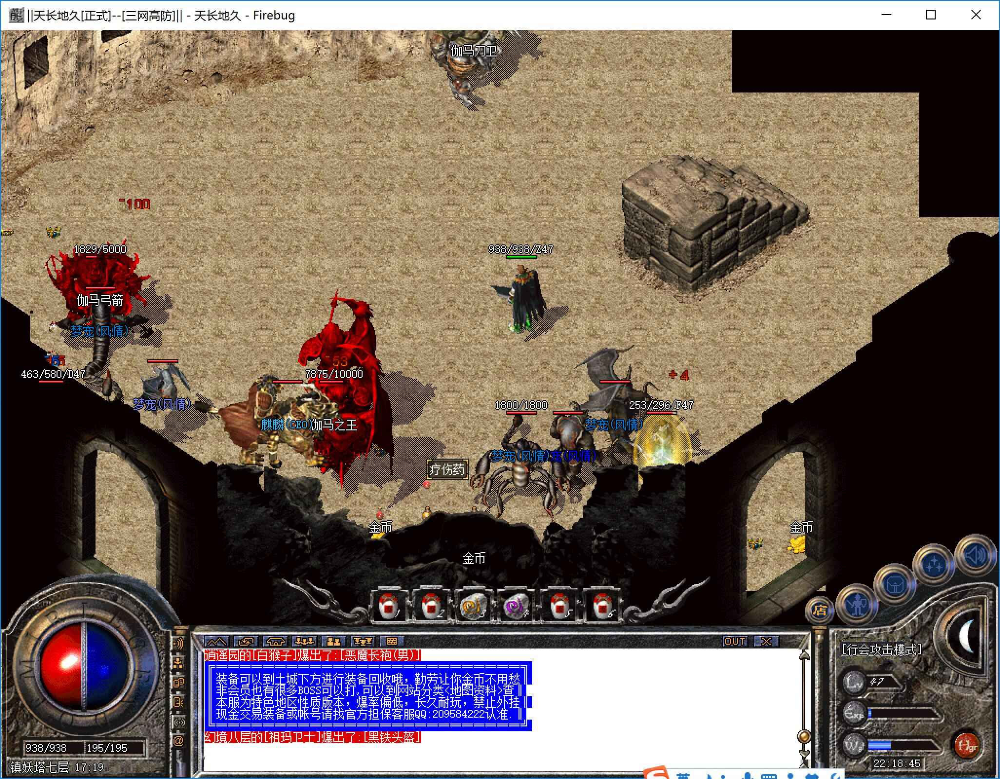
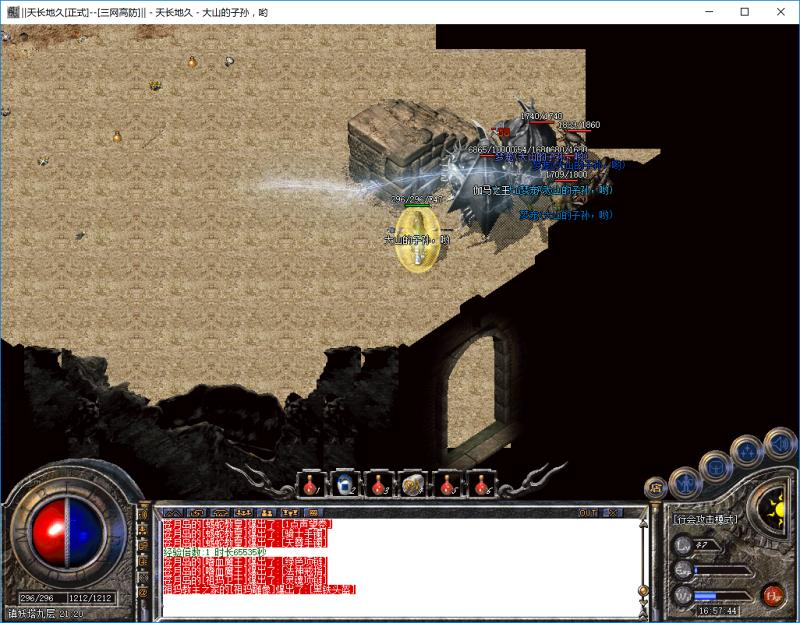
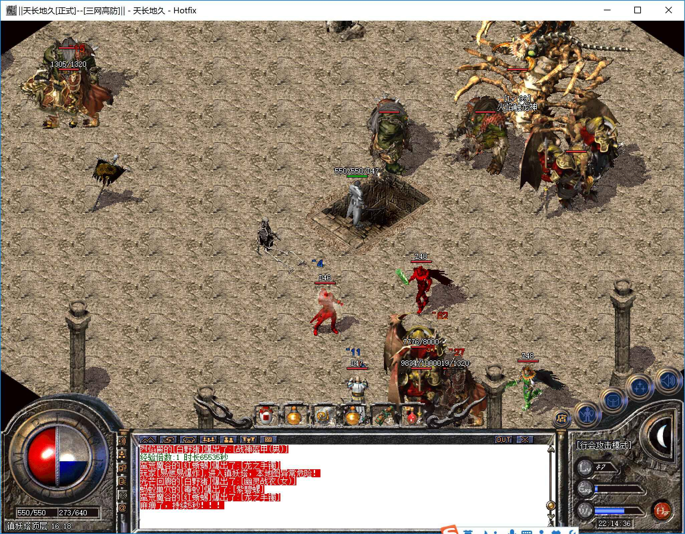
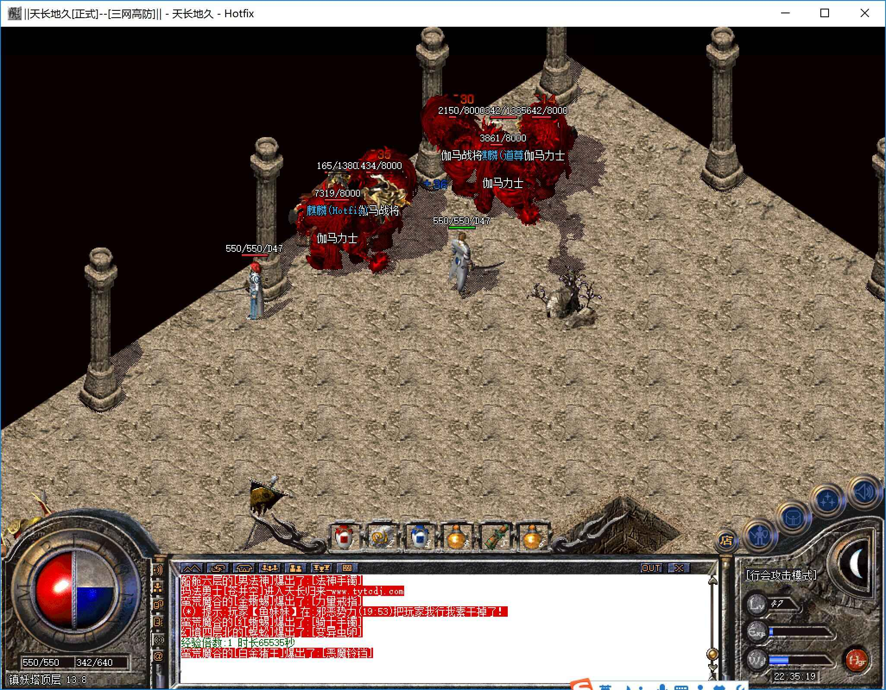
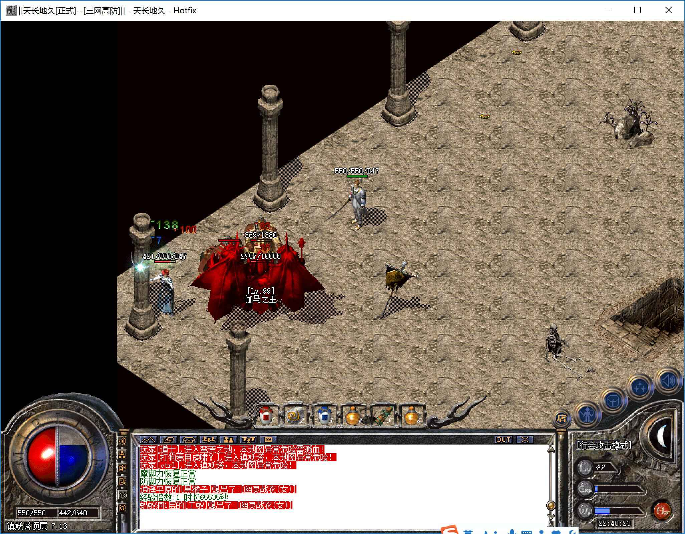
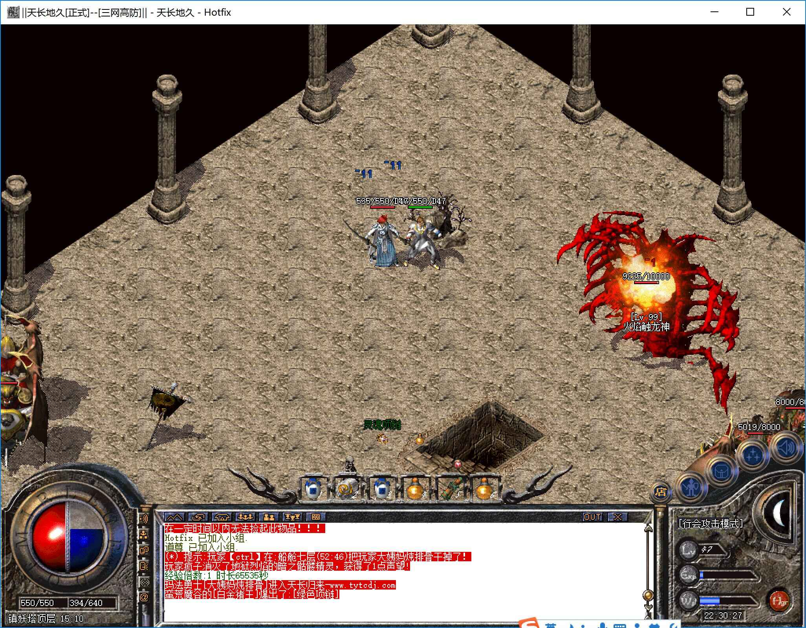

# 镇妖塔

* 进入方式：[幽灵船](幽灵船.html)→船舱顶层→镇妖塔通道
* 进入条件：等级40，金币5W
* 地图路线：船舱顶层→镇妖塔一层→镇妖塔二层→镇妖塔三层→镇妖塔四层→镇妖塔五层→镇妖塔六层→镇妖塔七层→镇妖塔八层→镇妖塔九层→镇妖塔顶层

```
 tips：不允许使用随机
```

-------


####镇妖塔一层----镇妖塔四层
* 危险系数：★★★☆☆
* 装备爆率：★★☆☆☆
* 怪物：伽马刀兵、伽马射手、伽马战将、伽马力士
* Boss：无

-------


####镇妖塔五层----镇妖塔九层
* 危险系数：★★★★★
* 装备爆率：★★★★★
* 刷新时间：1小时
* 怪物：伽马刀兵、伽马射手、伽马战将、伽马力士
* Boss：伽马之王




```
 tips1：奇数层伽马之王为远程射箭伽马王，偶数层为近战伽马王。射箭的需要先把其他小怪清掉再打好一点。
 tips2：走每层左下方的门可以返回上一层，只有顶层不可返回。
```
-------

####镇妖塔顶层
* 危险系数：★★★★★
* 装备爆率：★★★★★
* 刷新时间：1小时
* 怪物：食人花、伽马刀兵、伽马射手、伽马战将、伽马力士
* Boss：伽马之王（三个）、火焰触龙神

-------






